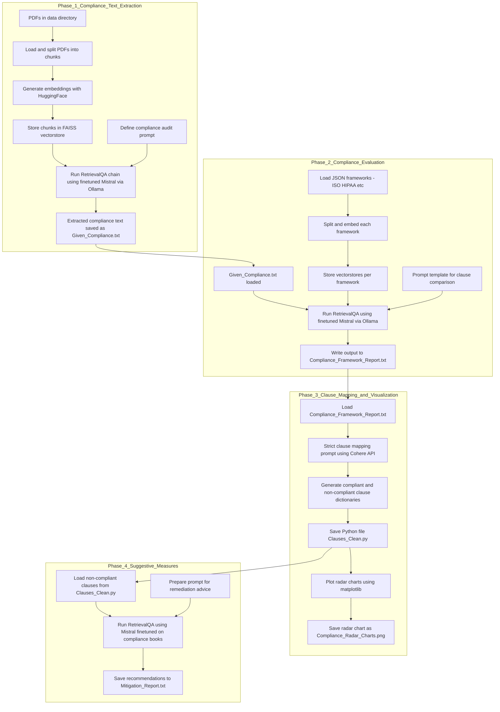

# AI-GRC_Pvt

## Visual Pipeline

```mermaid
graph TD

%% === Phase 1: Extract Compliance Text from PDF ===
subgraph Phase_1_Compliance_Text_Extraction
    A1[PDFs in data directory]
    A2[Load and split PDFs into chunks]
    A3[Generate embeddings with HuggingFace]
    A4[Store chunks in FAISS vectorstore]
    A5[Define compliance audit prompt]
    A6[Run RetrievalQA chain using finetuned Mistral via Ollama]
    A7[Extracted compliance text saved as Given_Compliance.txt]

    A1 --> A2
    A2 --> A3
    A3 --> A4
    A4 --> A6
    A5 --> A6
    A6 --> A7
end

%% === Phase 2: Framework-wise Compliance Check ===
subgraph Phase_2_Compliance_Evaluation
    B1[Given_Compliance.txt loaded]
    B2[Load JSON frameworks - ISO HIPAA etc]
    B3[Split and embed each framework]
    B4[Store vectorstores per framework]
    B5[Prompt template for clause comparison]
    B6[Run RetrievalQA using finetuned Mistral via Ollama]
    B7[Write output to Compliance_Framework_Report.txt]

    B1 --> B6
    B2 --> B3
    B3 --> B4
    B4 --> B6
    B5 --> B6
    B6 --> B7
end

%% === Phase 3: Clause Classification and Graph ===
subgraph Phase_3_Clause_Mapping_and_Visualization
    C1[Load Compliance_Framework_Report.txt]
    C2[Strict clause mapping prompt using Cohere API]
    C3[Generate compliant and non-compliant clause dictionaries]
    C4[Save Python file Clauses_Clean.py]
    C5[Plot radar charts using matplotlib]
    C6[Save radar chart as Compliance_Radar_Charts.png]

    C1 --> C2
    C2 --> C3
    C3 --> C4
    C4 --> C5
    C5 --> C6
end

%% === Phase 4: Suggestive Measures for Non-Compliance ===
subgraph Phase_4_Suggestive_Measures
    D1[Load non-compliant clauses from Clauses_Clean.py]
    D2[Prepare prompt for remediation advice]
    D3[Run RetrievalQA using Mistral finetuned on compliance books]
    D4[Save recommendations to Mitigation_Report.txt]

    D1 --> D3
    D2 --> D3
    D3 --> D4
end

A7 --> B1
B7 --> C1
C4 --> D1
```
