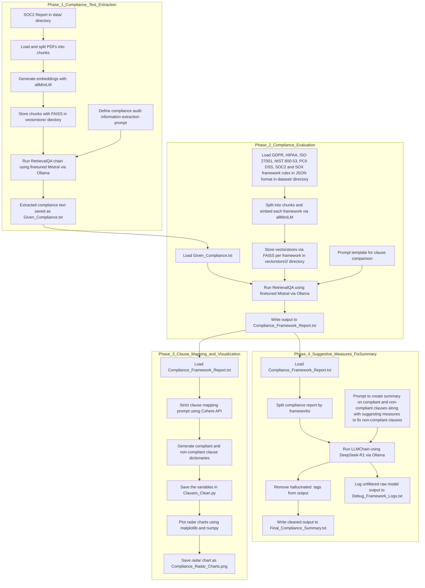

# AI-GRC_Pvt

## Visual Pipeline

```mermaid
graph TD

%% === Phase 1: Extract Compliance Text from PDF ===
subgraph Phase_1_Compliance_Text_Extraction
    A1[SOC2 Report in data/ directory]
    A2[Load and split PDFs into chunks]
    A3[Generate embeddings with allMiniLM]
    A4[Store chunks with FAISS in vectorstore/ diectory]
    A5[Define compliance audit information extraction prompt]
    A6[Run RetrievalQA chain using finetuned Mistral via Ollama]
    A7[Extracted compliance text saved as Given_Compliance.txt]

    A1 --> A2
    A2 --> A3
    A3 --> A4
    A4 --> A6
    A5 --> A6
    A6 --> A7
end

%% === Phase 2: Framework-wise Compliance Check ===
subgraph Phase_2_Compliance_Evaluation
    B1[Load Given_Compliance.txt]
    B2[Load GDPR, HIPAA, ISO 27001, NIST 800-53, PCII DSS, SOC2 and SOX framework rules in JSON format in dataset/ directory]
    B3[Split into chunks and embed each framework via allMiniLM]
    B4[Store vectorstores via FAISS per framework in vectorstore2/ directory]
    B5[Prompt template for clause comparison]
    B6[Run RetrievalQA using finetuned Mistral via Ollama]
    B7[Write output to Compliance_Framework_Report.txt]

    B1 --> B6
    B2 --> B3
    B3 --> B4
    B4 --> B6
    B5 --> B6
    B6 --> B7
end

%% === Phase 4: Suggestive Measures for Non-Compliance (Final Fix Summary Generation) ===
subgraph Phase_4_Suggestive_Measures_FixSummary
    D1[Load Compliance_Framework_Report.txt]
    D2[Split compliance report by frameworks]
    D3[Prompt to create summary on compliant and non-compliant clauses along with suggesting measures to fix non-compliant clauses]
    D4[Run LLMChain using DeepSeek-R1 via Ollama]
    D5[Remove hallucinated <think> tags from output]
    D6[Write cleaned output to Final_Compliance_Summary.txt]
    D7[Log unfiltered raw model output to Debug_Framework_Logs.txt]

    D1 --> D2
    D2 --> D4
    D3 --> D4
    D4 --> D5
    D5 --> D6
    D4 --> D7
end

%% === Phase 3: Clause Classification and Graph ===
subgraph Phase_3_Clause_Mapping_and_Visualization
    C1[Load Compliance_Framework_Report.txt]
    C2[Strict clause mapping prompt using Cohere API]
    C3[Generate compliant and non-compliant clause dictionaries]
    C4[Save the variables in Clauses_Clean.py]
    C5[Plot radar charts using matplotlib and numpy]
    C6[Save radar chart as Compliance_Radar_Charts.png]

    C1 --> C2
    C2 --> C3
    C3 --> C4
    C4 --> C5
    C5 --> C6
end


A7 --> B1
B7 --> C1
B7 --> D1
```
